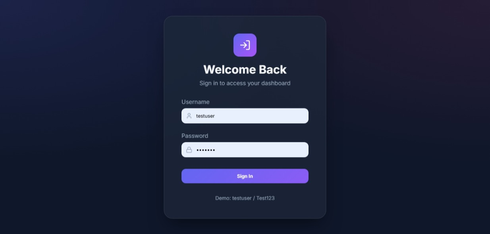
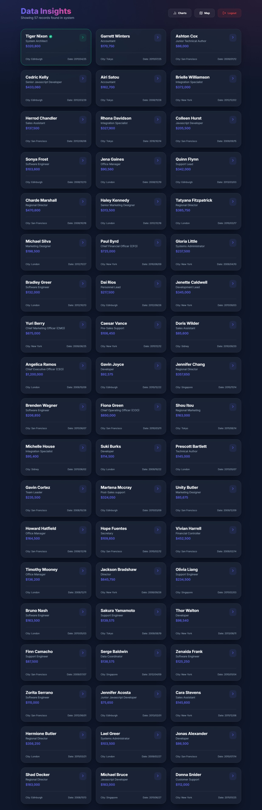
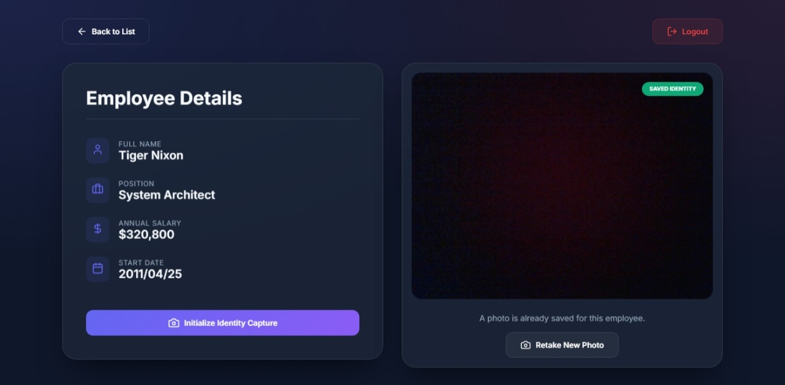
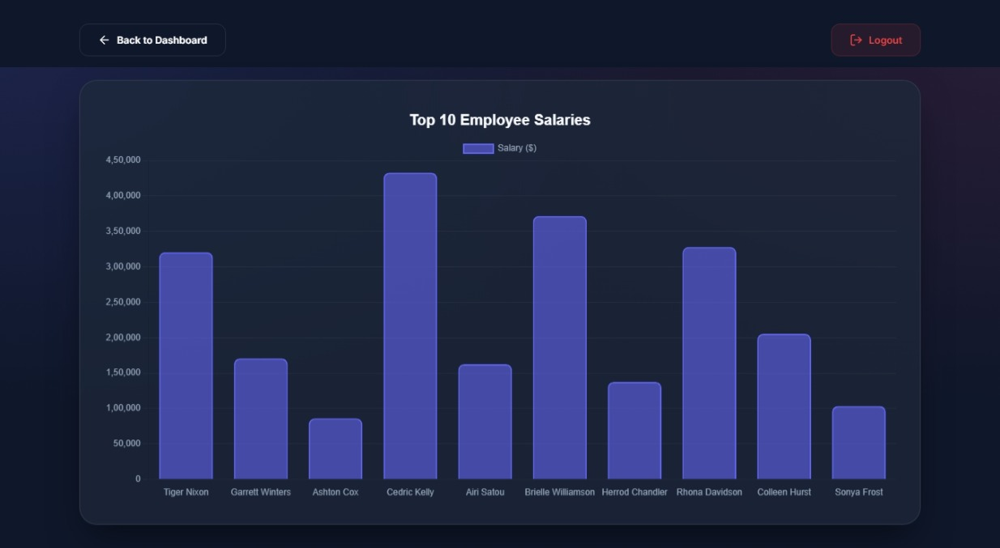

# 🚀 Premium Employee Management & Insights Dashboard

An advanced, high-performance React application designed with **Glassmorphism aesthetics** and **Real-time Data Visualization**. This platform provides a seamless experience for managing employee records, tracking global talent distribution, and verifying identities through integrated biometric capture.

### 📸 Visual Overview

#### 🎥 Walkthrough Video
<div align="center">
  <video src="https://raw.githubusercontent.com/Reethikaa05/Employee-Management-Insights-Dashboard/main/public/video/ScreenRecord.mp4" width="100%" controls>
    Your browser does not support the video tag. You can <a href="https://raw.githubusercontent.com/Reethikaa05/Employee-Management-Insights-Dashboard/main/public/video/ScreenRecord.mp4">download the video here</a>.
  </video>
</div>

#### 🖼️ Screenshot Gallery

| **Login Experience** | **Data Insights Dashboard** |
|:---:|:---:|
|  |  |

| **Biometric Identity Capture** | **Dynamic Analytics** |
|:---:|:---:|
|  |  |

| **Global Talent Distribution Map** |
|:---:|
|  |

## ✨ Key Features


### 🔐 Secure & Dynamic Authentication
- High-fidelity login interface with **Confetti feedback**.
- Protected routing system ensuring data security for authorized personnel only.
- Demo Credentials: `testuser` / `Test123`

### 📊 Professional Data Dashboard
- **RESTful Integration**: Real-time employee data fetching with handled CORS-preflight optimization.
- **Smart Formatting**: Converts raw API array structures into clean, usable objects.
- **Visual Verification Icons**: Interactive cards that show "Verified" checkmarks for employees with captured records.

### 📈 Creative Analytics & Visualizations
- **Dynamic Charting**: Interactive Bar Graphs visualizing compensation across the top 10 employees.
- **Global Map Integration**: A premium **Dark-Themed Map** (Leaflet) plotting global talent hubs with interactive popups and coordinate jittering for optimal visibility.

### 📸 Biometric Identity Capture
- **Real-time Camera Stream**: Seamless browser-based camera activation with permission handling.
- **Instant Processing**: Capture high-resolution identity photos with "Verified" badge generation.
- **Individual Memory**: The system independently stores and remembers captured photos for each employee throughout the session.

## 🛠️ Tech Stack

- **Core**: React 18 + Vite (Ultra-fast HMR)
- **Styling**: Vanilla CSS with Design Tokens (Glassmorphism & Neon accents)
- **Icons**: Lucide React
- **Animations**: Framer Motion
- **Data Visualization**: Chart.js & React-Leaflet
- **API Interaction**: Axios with custom `text/plain` tunneling

## 🚀 Getting Started

1. **Install Dependencies**:
   ```bash
   npm install
   ```

2. **Run Environment**:
   ```bash
   npm run dev
   ```

3. **Production Build**:
   ```bash
   npm run build
   ```

## 🧠 Solved Technical Challenges

- **CORS Bypass**: Implemented `text/plain` tunneling for the `POST` requests to overcome server-side preflight restrictions.
- **Camera Synchronization**: Solved React Ref lifecycle issues by using a `useEffect` synchronization hook to ensure the video stream attaches only when the DOM is ready.
- **Data Normalization**: Built a custom layer to map 2D array responses from the backend into strongly-typed frontend objects.

---
